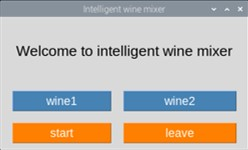
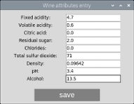
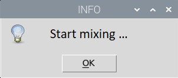
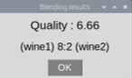

# IntelligentWineMixer

## Table of Contents

- [Objective](#objective)
- [File structure](#file-structure)
- [Hardware](#hardware)
- [Utility](#utility)

## Objective

Provide a access for users  to generate higher quality wines via GUI.

## File structure

```
├── .gitignore
├── main.py
├── scripts
|   ├── __init__.py
|   ├── GUI_function.py
|   └── motor_function.py
├── model
|   ├── train.py
|   └── winequality.csv
├── images
|   ├── initial_window.jpg
|   ├── entry_window.jpg
|   ├── message_window.jpg
|   └── finish_window.jpg
├── README.md
└── LICENSE
```

## Hardware

- Raspberry pi 3B+
- 28BYJ-45-5V (step motor)
- ULN2003 (otor driver)
- Routing (BCM)

        # motor 1
        IN1 -> 17
        IN2 -> 18
        IN3 -> 27
        IN4 -> 22
        
		# motor2
        IN1 -> 10
        IN2 -> 9
        IN3 -> 11
        IN4 -> 8

## Utility

### Run

Use `python3 main.py` to launch GUI.

### GUI

#### a. Initial window

- Allow user to enter the attributes of wine1 and wine2 through the button **wine1** and **wine2**.
- Start calculating and blending process with the button **start**.
- Use button **leave** to close program.

	

#### b. Entry page

- Allow user to enter 9 attributes of the wine.
- Click **save** button after filling all entries.

	

#### b. Hint

- Click **OK** to start calculating and blending process.

	

#### b. Finish window

- Display the quality and the blending ratio of the mix.

	

## Model training

- Datasets: ./model/winequality.csv
- Model architecture: Random Forest

### Training

```bash
$ cd ./model/
$ python3 motor_main.py [-d] <PATH to winequality.csv> [-s] <Save model name>
```

## **License**

This project is licensed under MIT License - see the [LICENSE](./LICENSE)